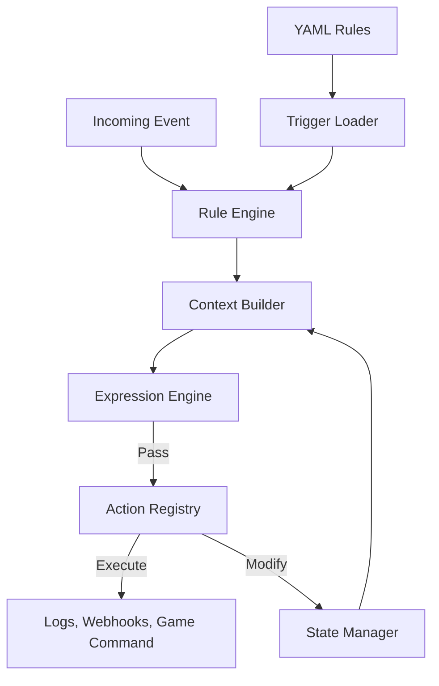

# Architecture

The Agnostic Trigger System is built on a modular pipeline designed to be decoupled from any specific host application (like a game or web server).

## System Overview

## Core Components

### 1. Trigger Loader (`src/io`)

Responsible for reading rules from external sources (Filesystem, API, Database). It currently supports YAML files and includes a **Hot Reloader** that updates the engine at runtime without restarting the application.

### 2. Rule Engine (`src/core`)

The orchestrator. It filters rules by the incoming `event` type, evaluates their conditions, and executes their actions. The system provides a hierarchical architecture:

**TriggerEngine** (Base): Platform-agnostic base engine with:
- Core rule processing logic
- Basic action handling
- Condition evaluation
- Cooldown management
- Extensible design

**RuleEngine** (Extension): Extends TriggerEngine with advanced features:
- Priority sorting
- Error handling
- Observability via event emitter
- State management integration
- Action registry with built-in actions
- Enhanced configuration options

This design allows using TriggerEngine for simple, platform-agnostic scenarios, while RuleEngine provides full-featured capabilities for complex applications.

### 3. Expression Engine (`src/core/expression-engine.ts`)

A robust evaluator for conditions. It handles:

- **Nested lookups**: `data.user.stats.level`
- **Type coercion**: Comparing strings to numbers safely
- **Dynamic Values**: Resolving `${globals.server_id}` inside values.

### 4. State Manager (`src/core/state-manager.ts`)

Enables **Stateful Logic**. Unlike simple "If This Then That" engines, this system can remember history (e.g., "Count clicks", "Has user visited before?"). It relies on a `PersistenceAdapter` to save data to disk or DB.

### 5. Action Registry (`src/core/action-registry.ts`)

A plugin system for actions. The core system knows nothing about "Discord Webhooks" or "Minecraft Commands". These are registered by the host application at runtime, keeping the core pure.

**Built-in Actions**: The registry includes several pre-defined actions:
- `log` - Logging with template interpolation
- `response` - HTTP response generation
- `execute` - Command execution (Node.js only)
- `forward` - HTTP request forwarding
- `STATE_SET`, `STATE_INCREMENT` - State management
- `EMIT_EVENT` - Event emission for chaining

**Integration**: RuleEngine automatically integrates with ActionRegistry, while TriggerEngine can work independently or with custom action handlers.

### 6. State Manager (`src/core/state-manager.ts`)

Singleton that enables **Stateful Logic** with configurable persistence. Unlike simple "If This Then That" engines, this system can remember history (e.g., "Count clicks", "Has user visited before?"). It supports:

- In-memory storage (default)
- Pluggable persistence adapters (file system, database)
- Atomic operations (increment, decrement, delete)
- Full state clearing and bulk operations

### 7. Developer Tooling (`src/lsp`)

To ensure high-quality rule development, the system includes a **Language Server Protocol (LSP)** implementation. This component shares the same validation logic as the core engine (via ArkType), providing a unified validation experience between rule authoring and runtime execution.
